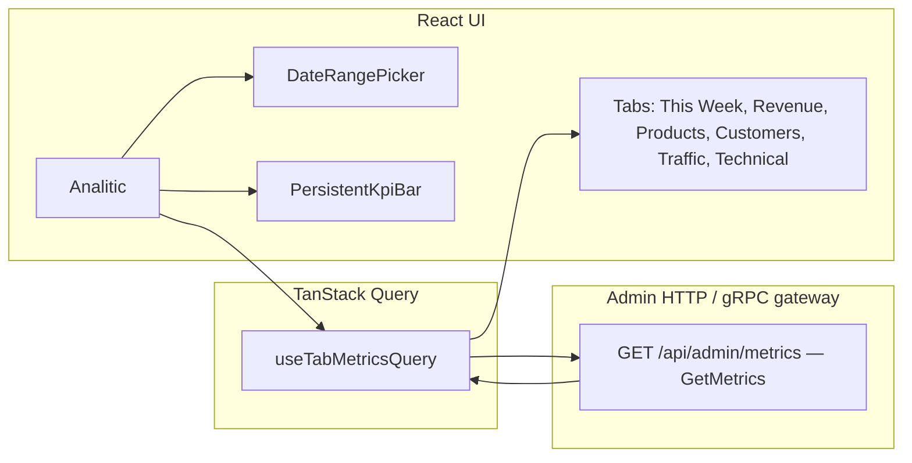

# Analytics Dashboard — Architecture & Metrics

This note describes how the **Analytics Dashboard** works in `grbpwr-admin-client`: routing, data loading, period/compare semantics, tab layout, and the metrics surfaced in the UI versus those defined in the admin API contract.

> **Scope:** Frontend behavior and protobuf shapes as checked into this repo. Actual SQL/warehouse jobs live on the backend; comments in `admin.proto` name sources (DB, GA4, BigQuery) where the contract documents them.

---

## 1. Entry point & navigation

| Item | Detail |
|------|--------|
| **Route** | `ROUTES.main` → `/main` (default authenticated landing after login) |
| **Component** | `Analitic` in `src/components/managers/page/index.tsx` |
| **Sidebar** | Labelled **ANALYTICS** / **analytics** in `src/constants/routes.ts` |

The dashboard is **not** a separate micro-app: it is one lazy-loaded React route under the shared `Layout` and `ProtectedRoute`.

---

## 2. High-level data flow

1. User picks **period** (`7d` \| `30d` \| `90d` \| `custom`), **compare mode**, and optionally a **custom date range**.
2. `useTabMetricsQuery` builds a `GetMetricsRequest` with a **tab-specific list of `MetricsSection` values** (partial response — smaller payloads, faster loads).
3. Response is typed as `GetMetricsResponse`: a `business` object plus optional **repeated section payloads** (funnel rows, web vitals, etc.).
4. The active tab component reads `metricsResponse` and renders charts/tables.

**Caching:** `staleTime` is **2 minutes** for tab metrics queries (`useTabMetricsQuery.ts`).

---

## 3. URL state: active tab

Tabs are synced to the query string:

- **`?tab=this-week`** (default if missing or invalid)
- Valid ids: `this-week`, `revenue`, `products`, `customers`, `traffic`, `technical`

Implementation: `useSearchParams` + `setActiveTab` updates `tab` with `replace: true` so history does not spam on tab switches.

---

## 4. Period & comparison semantics

### 4.1 Period (`MetricsPeriod`)

| UI value | Request `period` string |
|----------|---------------------------|
| 7 days | `7d` |
| 30 days | `30d` |
| 90 days | `90d` |
| Custom | ISO-8601 duration from inclusive day count, e.g. `P14D` via `dateRangeToIso8601Duration(from, to)` |

For **custom** ranges, `end_at` is sent as `customTo.toISOString()` (protobuf `Timestamp` on the wire).

### 4.2 Compare mode (`CompareMode`)

| Enum | UI label |
|------|----------|
| `COMPARE_MODE_NONE` | No comparison |
| `COMPARE_MODE_PREVIOUS_PERIOD` | Previous period (same length, immediately before) |
| `COMPARE_MODE_SAME_PERIOD_LAST_YEAR` | Same period last year |

When compare is **none**, the persistent KPI bar omits delta arrows; many time series still have primary series only.

### 4.3 `MetricWithComparison` (business aggregates)

Key fields used by the UI (`admin.proto`):

- `value`, `compare_value`
- `change_pct`, `change_absolute` (preferred for rate metrics; avoids misleading “rate of rates”)
- `lower_is_better` (e.g. refund rate, bounce rate — green when down)
- `caveat` — optional backend tooltip text

Helpers in `src/components/managers/page/utils.ts` normalize protobuf decimals and comparisons for charts/cards.

---

## 5. API: `GetMetrics`

| | |
|--|--|
| **RPC** | `GetMetrics(GetMetricsRequest) returns (GetMetricsResponse)` |
| **HTTP** | `GET /api/admin/metrics` (per `admin.proto` google.api.http annotation) |
| **Client** | `adminService.GetMetrics(...)` via generated `api/proto-http/admin` |

### 5.1 Request highlights

- `period` — see §4.1
- `end_at` — optional end timestamp (custom picker passes `customTo`)
- `compare_mode`
- `sections` — **which blocks to populate**; empty means business-only (not used by the dashboard tabs — tabs always pass explicit sections)
- `limit` — optional; proto notes sections that honor it (e.g. journeys, entry products, pareto, inventory, size run efficiency)
- `trend_granularity` — enum `DAILY` / `WEEKLY` / `MONTHLY` for trend bucket size; dashboard currently passes **`undefined`** (backend default)

### 5.2 Response shape (top level)

`GetMetricsResponse` contains:

1. **`business`** — `BusinessMetrics` (always requested for every tab via `METRICS_SECTION_BUSINESS`)
2. Optional **arrays / structs** per section — e.g. `funnel`, `web_vitals`, `cohort_retention`, …

If a section was **not** requested, those fields are typically empty/undefined.

---

## 6. Tab → requested `MetricsSection` map

Source: `TAB_SECTIONS` in `src/components/managers/page/useTabMetricsQuery.ts`.

| Tab ID | Sections requested |
|--------|-------------------|
| **this-week** | `BUSINESS`, `REVENUE_PARETO`, `CAMPAIGN_ATTRIBUTION` |
| **revenue** | `BUSINESS`, `FUNNEL` |
| **products** | `BUSINESS`, `REVENUE_PARETO`, `PRODUCT_TREND`, `PRODUCT_ENGAGEMENT`, `ADD_TO_CART_RATE`, `TIME_ON_PAGE`, `PRODUCT_ZOOM`, `IMAGE_SWIPES`, `SIZE_ANALYTICS`, `INVENTORY_HEALTH`, `SLOW_MOVERS`, `DEAD_STOCK`, `OOS_IMPACT`, `NOTIFY_ME_INTENT`, `SIZE_GUIDE_CLICKS`, `DETAILS_EXPANSION`, `SIZE_CONFIDENCE` |
| **customers** | `BUSINESS`, `COHORT_RETENTION`, `ORDER_SEQUENCE`, `SPENDING_CURVE`, `ENTRY_PRODUCTS`, `CATEGORY_LOYALTY` |
| **traffic** | `BUSINESS`, `CAMPAIGN_ATTRIBUTION` |
| **technical** | `WEB_VITALS`, `BROWSER_BREAKDOWN`, `FORM_ERRORS`, `EXCEPTIONS`, `NOT_FOUND`, `PAYMENT_FAILURES`, `SESSION_DURATION`, `USER_JOURNEYS` |

**Note:** The **technical** tab does **not** include `METRICS_SECTION_BUSINESS` in `TAB_SECTIONS`. The persistent KPI bar still calls `useTabMetricsQuery` with the same sections as the tab, so on **Technical** the KPI bar may lack fresh business numbers unless the backend fills `business` regardless (verify against your gateway implementation).

---

## 7. UI surface by tab

### 7.1 Global chrome (all tabs)

| Control | Behavior |
|---------|----------|
| **Title** | “Analytics Dashboard” |
| **DateRangePicker** | Period select + compare select + custom range popover (`react-day-picker`) |
| **PersistentKpiBar** | Six KPIs: Revenue, Orders, Conversion rate, AOV, Sessions, Cancellation rate (computed from `orders_by_status`, not a standalone metric) |

**Cancellation rate** is derived client-side: share of orders whose status name contains `CANCELLED` (`executiveAlerts.ts` → `orderCancellationSharePercent`). Highlighted in red in KPI bar and Revenue tab when **> 20%**.

### 7.2 This Week (`ThisWeekTab`)

Executive-oriented snapshot:

- **ExecutiveHealthStrip** — health badge (`on_track` \| `mixed` \| `needs_attention`), watch-list alerts, “Story of the period” (headwinds / tailwinds / operational bullets). Uses `executiveAlerts.ts` thresholds (see §9).
- **Orders by day** time series (+ compare series when enabled)
- **New / returning customers by day**
- **Top 3 products** — merged from `top_products_by_revenue` + units from `top_products_by_quantity`
- **Top traffic source** — first non-direct row from `traffic_by_source` (excludes “direct” / “none” in name)

Deep links use `?tab=revenue`, `?tab=products`, `?tab=traffic` on the current path.

### 7.3 Revenue & Orders (`RevenueTab`)

- Summary strip: revenue, gross revenue, orders, AOV, refund rate, cancellation rate
- Time series: revenue, AOV, gross revenue by day; collapsible **Shipping & Delivery** (units sold, shipped, delivered, refunds)
- **OrdersByStatusChart**
- **Purchase Funnel** (`
`): `FunnelChart` from `metricsResponse.funnel` — see §8.1
- **Payment Methods** (`
`): `CurrencyPaymentCharts`
- **PromoTable** — promo-attributed revenue

### 7.4 Products (`ProductsTab`)

Grouped into `
` sections; supports **hash navigation** (e.g. `#atc-matrix`) for deep links.

| Block | Components / data |
|-------|-------------------|
| What’s selling | `ProductCharts`, `RevenueParetoChart`, ATC matrix (`AddToCartRateMatrixChart` or legacy `AddToCartRateTable`), `SlowMoversTable`, `DeadStockTable`, `ProductTrendTable` |
| Product engagement | `ProductEngagementBubbleMatrixChart`, `SizeAnalyticsTable`, `SizeGuideClicksTable`, `DetailsExpansionTable` |
| Inventory | `InventoryHealthTable`, `NotifyMeIntentTable`, `OOSImpactTable` |
| Deep dive | `ProductEngagementRadarChart`, `ProductEngagementTable`, `TimeOnPageTable`, `ProductZoomTable`, `ImageSwipesTable` |
| Below fold | `SizeConfidenceTable` |

Empty state when no product/order-derived signals exist for the period.

### 7.5 Customers (`CustomerTab`)

- **CLV distribution** — mean, median, p90; warnings for small `sample_size` (hide stats if sample size is below 3)
- **Cohort retention** table (M1–M6 counts + revenue columns)
- **Order sequence** chart + **spending curve** chart
- **Email opt-ins**, new/returning customers by day
- **CrossSellTable** from business metrics
- **Entry products** + **category loyalty** tables

`NewsletterCard` is **intentionally removed** (comment: deduplication issues on backend).

### 7.6 Traffic & Channels (`TrafficTab`)

- **CampaignAttributionTable** — UTM dimensions, sessions, users, conversions, revenue, conversion rate
- **Conversion rate by day**
- **Sessions / users / page views by day**
- **TrafficCharts**, **GeographyCharts** (from `business` geo fields)
- **KpiCards** filtered to `visibleGroupIds={['email']}` — Resend-derived email KPIs

### 7.7 Technical (`TechnicalTab`)

Engineering / SRE oriented:

- **WebVitalsCard** — `web_vitals` rows
- **NotFoundTable**, **ExceptionsTable**, **FormErrorsTable**, **PaymentFailuresTable**
- **UserJourneysTable**, **SessionDurationChart**
- **BrowserBreakdownTable**

---

## 8. Funnel & reconciliation (Revenue tab)

`FunnelSection` contains:

- **`aggregate`** — unique users per GA4-style step (see step list below)
- **`daily`** — `DailyFunnel` time series of the same steps
- **`db_orders_count`** — order count from DB for reconciliation with `purchase_users`
- **`ga4_sessions`** — GA4 session count vs BQ session-scoped `session_start_users`
- **`caveat`** — human-readable note on methodology gaps

**Steps rendered** (`FunnelChart.tsx` order):

1. Session Start  
2. View Item List  
3. Select Item  
4. View Item  
5. Size Selected  
6. Add to Cart  
7. Begin Checkout  
8. Add Shipping  
9. Add Payment  
10. Purchase  

Prior-period comparison for the funnel chart is **not implemented** in UI (explicit message when compare is on).

---

## 9. Executive alerts & health (This Week)

Implemented in `executiveAlerts.ts`.

### 9.1 Watch-list alerts (severity)

| Condition | Severity |
|-----------|----------|
| Cancellation share ≥ **15%** | `high` (links to Revenue tab) |
| Refund rate level ≥ **8%** | `warning` |
| Compare on: revenue change ≤ **-20%** | `warning` |
| Compare on: orders ≤ **-20%** | `warning` |
| Compare on: sessions ≤ **-15%** | `warning` |
| Compare on: conversion ≤ **-15%** | `warning` |
| Compare on: refund rate up more than **12%** (and lower-is-better) | `warning` |

### 9.2 Health status (`deriveHealthStatus`)

- Any **`high`** alert → `needs_attention`
- Compare on: revenue and orders both ≤ **-15%** → `needs_attention`
- Any **`warning`** alert → `mixed`
- Else narrative mix of headwinds/tailwinds → `mixed` or `on_track`

### 9.3 North-star narrative thresholds

Uses **±3%** (`NARRATIVE_PCT_THRESHOLD`) on YoY/previous-period deltas for revenue, orders, AOV, sessions, conversion, new users, bounce rate (bounce is **lower is better**). Special case: if orders down and AOV up, replaces conflicting bullets with “Fewer orders, higher AOV…”.

---

## 10. `BusinessMetrics` — field inventory (contract)

The following is derived from `message BusinessMetrics` in `proto/admin/admin/admin.proto`. The UI uses subsets per tab; charts read `TimeSeriesPoint` arrays and `MetricWithComparison` scalars.

### 10.1 Core commerce & discounts

- `revenue`, `gross_revenue`, `orders_count`, `avg_order_value`, `items_per_order`
- `refund_rate`, `total_refunded`, `total_discount`, `product_sale_discount`, `promo_code_discount`
- `promo_usage_rate` — share of orders with `promo_id` (distinct from sale-percent discounts)

**Proto notes:**  
`gross_revenue` = list + shipping before discounts/refunds; includes refunded orders’ original value.  
`revenue` = gross minus product sale discount, promo code discount, refunds.

### 10.2 Geography & payment

- `revenue_by_country`, `revenue_by_city`, `revenue_by_region`
- `avg_order_by_country`
- `revenue_by_currency`, `revenue_by_payment_method`

### 10.3 Product & category ranking

- `top_products_by_revenue`, `top_products_by_quantity`
- `revenue_by_category`, `cross_sell_pairs`
- `top_products_by_views` (GA4)

### 10.4 Customer & subscriber behavior

- `new_subscribers`, `repeat_customers_rate`, `avg_orders_per_customer`, `avg_days_between_orders`
- `clv_distribution` — sample stats for CLV UI
- `new_customers` — aggregate aligned with `new_customers_by_day`

### 10.5 Promo & order status

- `revenue_by_promo`, `orders_by_status` (`StatusCount`)

### 10.6 Daily time series (current + `_compare` pairs)

Revenue, orders, subscribers, gross revenue, refunds, AOV, units sold, new/returning customers, shipped, delivered — each with optional compare series.

### 10.7 GA4 traffic & engagement

- Scalars: `sessions`, `users`, `new_users`, `page_views`, `bounce_rate`, `avg_session_duration`, `pages_per_session`, `conversion_rate`, `revenue_per_session`
- **Note in proto:** `avg_session_duration` uses engagement-based derivation, not raw `averageSessionDuration`.
- Breakdowns: `sessions_by_country`, `traffic_by_source`, `traffic_by_device`, `top_products_by_views`
- Daily: `sessions_by_day`, `users_by_day`, `page_views_by_day`, `conversion_rate_by_day` (+ compares)

### 10.8 Email (Resend webhooks)

- `emails_sent`, `emails_delivered`, `email_delivery_rate`, `email_open_rate`, `email_click_rate`, `email_bounce_rate`

### 10.9 Shipping

- `avg_shipping_cost`, `total_shipping_cost`

---

## 11. Section payloads (non-`business`) — metric definitions

Each row type is a **repeated** field on `GetMetricsResponse` unless noted. Names are protobuf snake_case in API; TypeScript client uses camelCase.

| Section enum | Response field | Meaning (abbrev.) |
|----------------|----------------|-------------------|
| FUNNEL | `funnel` | `FunnelSection` — aggregate + daily + reconciliation counts |
| OOS_IMPACT | `oos_impact` | Per date/product/size: clicks, estimated lost sales/revenue |
| PAYMENT_FAILURES | `payment_failures` | By date, error code, payment type, counts and failed value stats |
| WEB_VITALS | `web_vitals` | By date, metric name/rating, sessions, conversions, avg value |
| USER_JOURNEYS | `user_journeys` | Path string, session count, conversions |
| SESSION_DURATION | `session_duration` | Avg/median time between events (seconds) |
| DEVICE_FUNNEL | `device_funnel` | *(Defined in proto; not in current tab `TAB_SECTIONS`)* |
| PRODUCT_ENGAGEMENT | `product_engagement` + `product_engagement_bubble_matrix` | Image views, zoom, scroll depth, time on page; bubble matrix aggregates |
| FORM_ERRORS | `form_errors` | Field name, error count by date |
| EXCEPTIONS | `exceptions` | Page path, exception count, description |
| NOT_FOUND | `not_found` | 404 path hits |
| HERO_FUNNEL | `hero_funnel` | Hero click → view item → purchase users *(component exists in `FunnelTab.tsx`, not wired to main router)* |
| SIZE_CONFIDENCE | `size_confidence` | Size guide views vs size selections by product |
| PAYMENT_RECOVERY | `payment_recovery` | Failed vs recovered users *(proto only in unused tabs)* |
| CHECKOUT_TIMINGS | `checkout_timings` | Avg/median checkout seconds *(unused in main tabs)* |
| COHORT_RETENTION | `cohort_retention` | Monthly cohort × M1–M6 counts and revenue |
| ORDER_SEQUENCE | `order_sequence` | Nth-order stats: count, AOV, avg days since previous |
| ENTRY_PRODUCTS | `entry_products` | First-purchase product concentration |
| REVENUE_PARETO | `revenue_pareto` | Ranked products with cumulative revenue % |
| SPENDING_CURVE | `spending_curve` | Order index vs avg cumulative spend and customer count |
| CATEGORY_LOYALTY | `category_loyalty` | First category → second category migration counts |
| INVENTORY_HEALTH | `inventory_health` | Qty, avg daily sales, days on hand by SKU |
| SIZE_RUN_EFFICIENCY | `size_run_efficiency` | Sold-through size ratio *(not in `TAB_SECTIONS` today)* |
| SLOW_MOVERS | `slow_movers` | Low revenue, units, days in stock, last sale, views |
| RETURN_ANALYSIS | `return_by_product`, `return_by_size` | Return rates by reason/size *(tables exist; section not in `TAB_SECTIONS`)* |
| SIZE_ANALYTICS | `size_analytics` | Units/revenue/% of product by size |
| DEAD_STOCK | `dead_stock` | Stock value, days without sale |
| PRODUCT_TREND | `product_trend` | Current vs previous revenue/units, % change |
| ADD_TO_CART_RATE | `add_to_cart_rate` (deprecated row list) + **`add_to_cart_rate_analysis`** | Per-product scatter + global trend |
| BROWSER_BREAKDOWN | `browser_breakdown` | Browser sessions/users/conversions |
| NEWSLETTER | `newsletter` | Signups *(not requested by active tabs)* |
| ABANDONED_CART | `abandoned_cart` | Funnel of cart vs checkout abandonment *(components exist; not in `TAB_SECTIONS`)* |
| CAMPAIGN_ATTRIBUTION | `campaign_attribution` | UTM-level performance |
| TIME_ON_PAGE | `time_on_page` | Visible vs total time, engagement score, page views |
| PRODUCT_ZOOM | `product_zoom` | Double-click vs pinch zoom counts |
| IMAGE_SWIPES | `image_swipes` | Next/prev swipe counts |
| SIZE_GUIDE_CLICKS | `size_guide_clicks` | Desktop/mobile location |
| DETAILS_EXPANSION | `details_expansion` | Section expands (description, composition, care) |
| NOTIFY_ME_INTENT | `notify_me_intent` | Opened / submitted / closed; conversion rate |
| GEOGRAPHY | `geography` | Dedicated geography section *(Traffic tab uses `business` geo metrics primarily)* |
| CUSTOMER_SEGMENTATION | `customer_segments` | Email, orders, revenue, segment label |
| RFM | `rfm_analysis` | R/F/M scores and labels *(not in `TAB_SECTIONS`)* |

Comments in proto often tag **(BQ)** = BigQuery-sourced analytics events.

---

## 12. Dead / alternate UI modules

These files exist under `src/components/managers/page/tabs/` but are **not** exported from `tabs/index.ts` or mounted in `Analitic`:

- `FunnelTab.tsx` — combines purchase funnel, **HeroFunnelChart**, **PaymentRecoveryCard**, **CheckoutTimingsCard**, **DeviceFunnelChart**, **AbandonedCartCard**, **ReturnByProductChart**, etc.
- Likely others (`BehaviourTab`, `MerchandisingTab`, `SiteHealthTab`, `OverviewTab`) — same situation unless imported elsewhere.

Treat them as **staging** or **deprecated entry points** unless you wire them back into routing.

---

## 13. File map (quick reference)

| Path | Role |
|------|------|
| `src/components/managers/page/index.tsx` | Dashboard shell, tab state, query hook |
| `src/components/managers/page/useTabMetricsQuery.ts` | Tab → sections, React Query |
| `src/components/managers/page/useMetricsQuery.ts` | Period/compare option constants, ISO duration helper |
| `src/components/managers/page/utils.ts` | Formatting, period labels, time series helpers |
| `src/components/managers/page/executiveAlerts.ts` | Alert thresholds, health, cancellation % |
| `proto/admin/admin/admin.proto` | Source of truth for RPC and messages |
| `src/api/proto-http/admin/index.ts` | Generated / hand-maintained TS types & client |

---

## 14. Obsidian usage tips

- Link this note from your vault’s **MOC** (map of content) for “Operations” or “Product analytics”.
- If you mirror the repo into Obsidian, use **relative links** to source files: `[[../../src/components/managers/page/index.tsx]]` (adjust path to your vault layout).
- Tag ideas: `#grbpwr` `#admin-ui` `#metrics`

---

## Sources

- `src/components/managers/page/index.tsx`
- `src/components/managers/page/useTabMetricsQuery.ts`
- `proto/admin/admin/admin.proto` (`GetMetrics`, `GetMetricsResponse`, `BusinessMetrics`, `MetricsSection`)
- `src/components/managers/page/executiveAlerts.ts`
- Tab components under `src/components/managers/page/tabs/`
